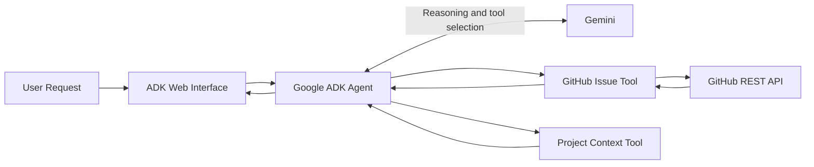

# AI Software Issue Triage & Resolution Agent

A Dockerized, tool-using AI agent built with **Google ADK**, **Gemini**, and the **GitHub REST API** to retrieve software issue data and perform AI-assisted analysis.

**Project Status:** Early-stage development. The current implementation supports GitHub issue retrieval and model-based analysis. This is not a production-ready service.

* **Docker Hub:** `ragini777/ai-issue-triage-agent`
* **Source Code:** https://github.com/Ragini-Roy7/ai-issue-triage-agent
* **Image Tag:** `v1`

---

## Project Overview

Software issue investigation often begins with gathering relevant context from issue trackers. This agent explores how LLM-based reasoning and external tools can be combined to automate part of that workflow.

Given a natural-language request, the agent uses Google ADK to determine whether a registered tool is required, retrieves issue information through the GitHub REST API, and uses Gemini to generate an analysis.

**Example request:**

`Fetch and summarize issue #1 from Ragini-Roy7/ai-issue-triage-agent`

The current implementation focuses on issue retrieval and AI-assisted analysis. Automated resolution is a future development objective.

## Architecture



### Request lifecycle

1. The user submits a natural-language request through the ADK Web interface.
2. The Google ADK agent processes the request.
3. Gemini determines whether an available tool should be invoked.
4. ADK executes the selected Python tool.
5. The GitHub integration retrieves issue information using the GitHub REST API.
6. The retrieved information is returned to the agent for analysis.
7. The agent generates a response through the ADK Web interface.

### Architecture components

| Component       | Responsibility                                |
| --------------- | --------------------------------------------- |
| Google ADK      | Agent orchestration and tool execution        |
| Gemini          | Model reasoning and tool selection            |
| Python tools    | Expose application functionality to the agent |
| GitHub REST API | Retrieve live GitHub issue information        |
| HTTPX           | HTTP communication with external APIs         |
| ADK Web         | Local interactive development interface       |

## Current Capabilities

The current implementation includes:

* Tool-using AI agent built with Google ADK.
* Gemini-powered reasoning and tool selection.
* GitHub issue retrieval through the GitHub REST API.
* Retrieval of issue metadata, including issue number, title, body, state, author and comment count.
* Project context retrieval through a dedicated Python tool.
* AI-assisted analysis of retrieved issue information.
* Containerized application execution using Docker.

## Technology Stack

| Technology            | Usage                        |
| --------------------- | ---------------------------- |
| Python                | Application implementation   |
| Google ADK            | Agent orchestration          |
| Gemini 3.5 Flash-Lite | LLM integration              |
| GitHub REST API       | Issue data retrieval         |
| HTTPX                 | HTTP client                  |
| Docker                | Application containerization |

## Docker Image

**Published image:**

`ragini777/ai-issue-triage-agent:v1`

| Property         | Value                             |
| ---------------- | --------------------------------- |
| Repository       | `ragini777/ai-issue-triage-agent` |
| Version          | `v1`                              |
| Base image       | `python:3.14-slim`                |
| Application port | `8000`                            |
| Runtime          | Google ADK Web                    |

The container packages the Python application and its dependencies. API credentials are provided at runtime rather than intentionally embedded in the image.

## Configuration

The application requires the following environment variable:

| Variable         | Purpose                                  |
| ---------------- | ---------------------------------------- |
| `GOOGLE_API_KEY` | Authenticates requests to the Gemini API |

### Secret management

Credentials should be supplied at runtime.

Do not:

* Commit API keys to GitHub.
* Include `.env` files in the Docker build context.
* Hardcode credentials in the Dockerfile.
* Publish credentials in Docker Hub documentation.

Use a local environment file or an appropriate secrets-management system for deployment environments.

## Running the Published Image

### Prerequisites

* Docker Engine or Docker Desktop.
* A valid Google API key.

### Pull the image

```powershell
docker pull ragini777/ai-issue-triage-agent:v1
```

### Configure the API key

Set the environment variable in PowerShell:

```powershell
$env:GOOGLE_API_KEY = Read-Host "Enter Google API key"
```

### Start the container

```powershell
docker run -d `
  --name issue-triage-agent `
  -p 8000:8000 `
  -e GOOGLE_API_KEY `
  ragini777/ai-issue-triage-agent:v1
```

### Access the application

Open:

`http://localhost:8000`

Submit a request such as:

`Fetch and summarize issue #1 from Ragini-Roy7/ai-issue-triage-agent`

## Container Operations

**Inspect running containers**

```powershell
docker ps
```

**View application logs**

```powershell
docker logs -f issue-triage-agent
```

**Inspect container configuration**

```powershell
docker inspect issue-triage-agent
```

**Stop the container**

```powershell
docker stop issue-triage-agent
```

**Remove the container**

```powershell
docker rm issue-triage-agent
```

## Build from Source

To build the image locally, the repository must contain the Dockerfile, `.dockerignore`, `requirements.txt`, and `my_agent` application package.

```powershell
git clone https://github.com/Ragini-Roy7/ai-issue-triage-agent.git

cd ai-issue-triage-agent
```

Build the image:

```powershell
docker build -t ai-issue-triage-agent:v1 .
```

Run it with a local environment file:

```powershell
docker run --rm `
  -p 8000:8000 `
  --env-file .\my_agent\.env `
  ai-issue-triage-agent:v1
```

The local environment file must contain `GOOGLE_API_KEY` and must never be committed to source control.

## Security and Operational Considerations

| Area                 | Current implementation                               | Further engineering work                                   |
| -------------------- | ---------------------------------------------------- | ---------------------------------------------------------- |
| Credentials          | Runtime environment variable injection               | Integrate a secrets manager                                |
| Dependencies         | Pinned Python dependencies                           | Vulnerability scanning and controlled updates              |
| Build context        | `.dockerignore` excludes local artifacts and secrets | Review exclusions as the project evolves                   |
| Container privileges | Non-root execution not configured                    | Introduce a dedicated non-root user                        |
| Health monitoring    | No health check configured                           | Add an application health endpoint and Docker health check |
| Observability        | Container logs available through Docker              | Structured logging, tracing and monitoring                 |
| CI/CD                | Not implemented                                      | Automated build, test, scan and publish pipeline           |

The current ADK Web interface is intended for development and testing. Additional authentication, access control and operational hardening would be required before exposing it as a production service.

## Limitations and Roadmap

### Current limitations

* Issue retrieval and analysis are the primary implemented workflow.
* Automated issue classification is not yet implemented.
* Tool provenance and response-grounding improvements remain development tasks.
* The application uses the ADK development interface.
* A production evaluation and observability framework is not yet established.

### Potential future extensions

* Retrieval of issue comments and linked repository context.
* Structured issue classification and prioritization.
* Test generation and suggested code changes.
* Human approval workflows before pull-request creation.
* Agent evaluation and observability.
* CI/CD automation and cloud deployment.

These are planned extensions, not current capabilities.

## Versioning

Current published image:

`ragini777/ai-issue-triage-agent:v1`

Future releases should use explicit version tags, maintain release notes and associate published images with their source-code commits.

Avoid relying on the mutable `latest` tag for reproducible deployments.

## Source Code

GitHub Repository:

https://github.com/Ragini-Roy7/ai-issue-triage-agent

Contributions, issues and technical feedback are welcome.


