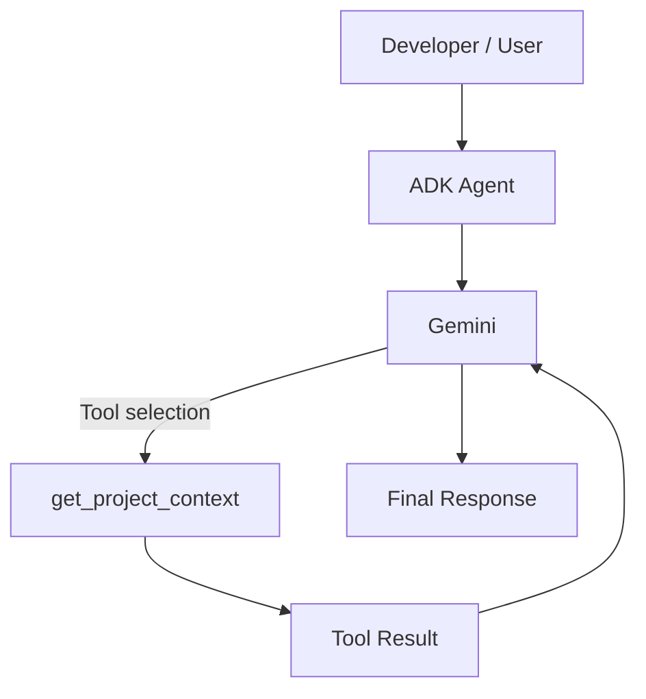

# AI Software Issue Triage & Resolution Agent

**An AI-powered software engineering agent that investigates issues, gathers evidence, proposes fixes, and progressively automates the path from bug report to verified resolution.**


> **Product status:** Early-stage, actively developed. The current release (**V1 — Tool-Using Agent**) demonstrates a single agent that reasons with Gemini and executes a deterministic Python tool through Google ADK. The system is being built incrementally toward a full issue-triage-to-resolution pipeline — see [Current Status](#3-current-status) for exactly what exists today.

---

## Table of Contents

1. [Product Overview](#1-product-overview)
2. [Product Vision](#2-product-vision)
3. [Current Status](#3-current-status)
4. [Current V1 Architecture](#4-current-v1-architecture)
5. [Agent Execution Flow](#5-agent-execution-flow)
6. [Why Tool Use?](#6-why-tool-use)
7. [Tech Stack](#7-tech-stack)
8. [Project Structure](#8-project-structure)
9. [Quick Start](#9-quick-start)
10. [Environment Variables](#10-environment-variables)
11. [Demo](#11-demo)
12. [Engineering Decisions](#12-engineering-decisions)
13. [Roadmap](#13-roadmap)
14. [Evaluation Strategy](#14-evaluation-strategy)
15. [Security Model](#15-security-model)
16. [Design Tradeoffs](#16-design-tradeoffs)
17. [Limitations](#17-limitations)
18. [Contributing](#18-contributing)
19. [License](#19-license)
20. [Author / Project Links](#20-author--project-links)

---

## 1. Product Overview

Traditional issue triage relies on a human reading a title, a description, and maybe a stack trace, then guessing at severity, ownership, and root cause. That process breaks down for a simple reason: **the issue description alone is rarely enough evidence.** The real signal — affected components, related code paths, recent changes, logs, reproduction context — lives scattered across the repository, not in the bug report.

An agentic approach is useful here because triage is not a single classification step, it is a small investigation. It benefits from a system that can:

- Decide *what information it needs* rather than have all of it handed over up front.
- Call tools to retrieve that information on demand.
- Reason over the combined evidence before producing a conclusion.

This project is designed to become a developer-facing agent that takes in raw issue signal (GitHub issues, descriptions, repository context, logs, screenshots, documentation, code, and eventually audio/video) and progressively narrows it down to a classified, investigated, and — eventually — verifiably fixed issue, with a human in control of anything destructive.

**Today, the system implements the smallest meaningful slice of that vision:** an agent that can decide to call a tool, execute it, and reason over the result.

## 2. Product Vision

The long-term system is designed around this pipeline:

```
Issue intake
   → analysis
   → evidence gathering
   → repository investigation
   → root-cause analysis
   → fix proposal
   → verification
   → engineering handoff
```

Each stage is intended to add a specific capability rather than being built all at once:

- **Issue intake & analysis** — understand and classify what is being reported.
- **Evidence gathering** — pull in the repository context, logs, and documentation needed to reason about the issue.
- **Investigation** — search the codebase and history for likely causes.
- **Fix proposal** — draft a candidate change.
- **Verification** — run tests / sandboxed execution against the candidate fix.
- **Handoff** — package the result as a PR or engineering-ready summary, with humans approving anything risky.

This is the **vision** the architecture is being built toward. It is *not* the current state of the repository — see the next section for that.

## 3. Current Status

| Version | Capability | Status |
|---|---|---|
| V0 | Basic ADK Agent | ✅ Complete |
| V1 | Tool-Using Agent | ✅ Complete (current) |
| V2 | GitHub Integration | ✅ Complete |
| V3 | Structured Issue Triage | ⬜ Planned |
| V4 | Repository Intelligence | ⬜ Planned |
| V5 | Custom MCP Server | ⬜ Planned |
| V6 | Investigation Workflow | ⬜ Planned |
| V7 | Multi-Agent Collaboration | ⬜ Planned |
| V8 | Multimodal Issue Analysis | ⬜ Planned |
| V9 | Sandboxed Code Execution | ⬜ Planned |
| V10 | Evaluation & Benchmarking | ⬜ Planned |
| V11 | Security & Guardrails | ⬜ Planned |
| V12 | Human-in-the-Loop | ⬜ Planned |
| V13 | Observability | ⬜ Planned |
| V14 | Deployment | ⬜ Planned |

## 4. Current V1 Architecture



**Components:**

- **Developer / User** — sends a natural-language request through the ADK Web development UI.
- **ADK Agent** — the Google ADK agent wrapper that manages the request/response lifecycle and tool registration.
- **Gemini** — the model (Gemini 3.5 Flash-Lite) responsible for interpreting the request and deciding whether a tool call is needed.
- **`get_project_context()`** — the current custom Python tool. It returns deterministic, static information about the project.
- **Tool Result** — the structured output handed back to the model.
- **Final Response** — Gemini's answer after incorporating the tool result.

## 5. Agent Execution Flow

1. The user sends a request through the ADK Web UI.
2. ADK invokes the registered agent.
3. Gemini interprets the request.
4. The model determines whether `get_project_context()` is useful for answering it.
5. If so, ADK executes the tool.
6. The tool returns deterministic information (no model involvement in this step).
7. The result is fed back into the model's context.
8. Gemini produces the final response, now grounded in the tool's output.

This differs from simply pasting all information into the prompt because the model is making an active **decision** about *when* it needs external information, rather than always receiving a fixed context blob. That decision-making step — tool selection — is the mechanism this whole project is built around, and every future version (GitHub access, repository search, sandboxed execution) extends this same loop with more capable tools rather than replacing it.

## 6. Why Tool Use?

The core separation this project relies on:

**LLM (Gemini)**
- Reasoning
- Interpretation
- Decision-making

**Tools**
- Deterministic operations
- External system access
- Data retrieval
- Actions

Keeping these separate matters because it is what makes the system extensible and trustworthy as it grows. When the agent eventually needs to talk to GitHub, read repository files, parse logs, run tests, or query a database, none of that should happen "inside" the model's imagination — it should happen through explicit, auditable tool calls with defined inputs and outputs. The model decides *what* to do; the tool decides *how* it actually gets done. This is also the foundation that later versions (MCP integration, sandboxed execution, multi-agent orchestration) build directly on top of.

## 7. Tech Stack

**Currently used:**

| Technology | Purpose |
|---|---|
| Python | Core implementation language |
| Google ADK | Agent framework, tool registration, dev UI |
| Gemini 3.5 Flash-Lite | Reasoning / tool-selection model |
| ADK Web | Local development and testing UI |
| Environment variables (`.env`) | API key configuration |

**Planned:**

| Technology | Purpose |
|---|---|
| GitHub API | Issue intake, repository access (V2) |
| MCP (Model Context Protocol) | Standardized tool/resource server (V5) |
| Pydantic / structured outputs | Schema-validated triage output (V3) |
| Sandbox execution environment | Safe code execution and verification (V9) |
| Evaluation tooling | Benchmarking accuracy, latency, cost (V10) |
| Docker | Containerized runtime (V14) |
| Cloud deployment | Production hosting (V14) |

## 8. Project Structure

**Current repository layout:**

```
ai-issue-triage-agent/
├── my_agent/
├── .gitignore
├── README.md
└── requirements.txt
```

> The `my_agent/` package contains the ADK agent definition and the `get_project_context()` tool. Structure inside it will expand as capabilities are added — see below.

**Planned future structure (not yet implemented):**

```
my_agent/
├── agents/
├── tools/
├── schemas/
├── prompts/
├── evaluation/
├── tests/
├── mcp_server/
└── ...
```

## 9. Quick Start

Current environment: **Windows**, Python virtual environment, Google ADK, Gemini API key.

```powershell
# 1. Clone the repository
git clone https://github.com/Ragini-Roy7/ai-issue-triage-agent.git
cd ai-issue-triage-agent

# 2. Create a virtual environment
python -m venv .venv

# 3. Activate it
.venv\Scripts\Activate.ps1

# 4. Install dependencies
pip install -r requirements.txt

# 5. Create the environment file
New-Item my_agent\.env

# 6. Add your Gemini API key to my_agent/.env
#    GEMINI_API_KEY=your_key_here

# 7. Start the ADK Web development UI
adk web

# 8. Open the local development UI
#    (URL printed in the terminal, typically http://localhost:8000)

# 9. Send a test request to the agent from the UI
```

## 10. Environment Variables

| Variable | Description |
|---|---|
| `GEMINI_API_KEY` | API key used by the agent to call Gemini. |

> ⚠️ **Never commit API keys.** Keep `.env` listed in `.gitignore` and out of version control at all times.

## 11. Demo

[▶ Watch the V1 Agent Demo](#)

**Demo flow:**

```
User request → Agent → Tool selection → Tool execution → Tool result → Final response
```

## 12. Engineering Decisions

### Incremental complexity
The project intentionally evolves through milestones (V0 → V14) rather than introducing multi-agent orchestration or MCP infrastructure before the foundational tool-use loop is solid.

### Deterministic tools + probabilistic reasoning
The model handles interpretation and decision-making; tools handle deterministic operations. This separation is what keeps the system predictable as more tools are added.

### Human control
Future stages that can modify code, open PRs, or execute anything against a real environment are designed to require explicit human approval before acting.

### Evidence over assumptions
Future investigation stages are designed to gather repository, log, and test evidence *before* proposing a root cause, rather than inferring one from the issue text alone.

### Security by design
Future versions must account for prompt injection, tool poisoning, secret leakage, path traversal, unsafe commands, least privilege, and sandboxing — addressed as the relevant capabilities (V9, V11) are built, not retrofitted afterward.

## 13. Roadmap

| Version | Capability | Engineering Concepts |
|---|---|---|
| V1 | Tool use | ADK tool registration, tool schemas, model-tool loop |
| V2 | GitHub integration | REST APIs, auth, pagination, retries, rate limits |
| V3 | Structured triage | Pydantic, structured outputs, validation |
| V4 | Repository intelligence | Code search, dependency analysis, commit history |
| V5 | MCP | MCP host/client/server, tools/resources/prompts, JSON-RPC, transport |
| V6 | Investigation workflow | Orchestration, state, retries, deterministic vs. agentic steps |
| V7 | Multi-agent | Specialization, delegation, agent-to-agent communication, concurrency |
| V8 | Multimodal | Screenshots, logs, images, video, document intelligence |
| V9 | Sandbox execution | Testing, linting, type checking, isolation |
| V10 | Evaluation | Benchmark datasets, accuracy, tool selection, hallucination, latency, cost |
| V11 | Security | Prompt injection, tool poisoning, permissions, sandboxing |
| V12 | Human-in-the-loop | Approval gates for risky actions |
| V13 | Observability | Tracing, latency, tokens, cost, errors |
| V14 | Deployment | Docker, cloud runtime, remote MCP, authentication |

## 14. Evaluation Strategy

No evaluation framework is implemented yet. This section describes the intended approach once V10 is reached.

An agentic triage system should not be evaluated only by whether its final answer "looks good" — a plausible-sounding response can still be based on the wrong evidence, the wrong tool, or no evidence at all. A meaningful evaluation needs to check the *process*, not just the output.

Planned metrics include:

- Issue classification accuracy
- Severity classification accuracy
- Root-cause agreement (vs. known/ground-truth causes)
- Evidence relevance
- Tool selection accuracy
- Test pass rate (for proposed fixes)
- Hallucination rate
- Latency
- Token usage
- Cost per issue
- Failure / retry rate

## 15. Security Model

No security or guardrail layer is implemented yet (planned for V11). The intended model, once built, treats the following as core boundaries:

- Treat GitHub issues, README files, logs, and any retrieved content as **untrusted data**.
- Never blindly follow instructions found inside retrieved content.
- Restrict tool permissions to the minimum required.
- Validate all tool inputs.
- Prevent secret leakage in logs, prompts, and outputs.
- Sandbox any generated or executed code.
- Require human approval for destructive or production-impacting operations.
- Audit all tool calls.

## 16. Design Tradeoffs

**Why not start with multi-agent?**
Additional agents introduce latency, cost, state management overhead, inter-agent communication complexity, harder debugging, and new failure modes. Introducing that complexity before a single agent's tool-use loop is well understood makes it harder to isolate what's actually going wrong when something breaks.

**Why start with a single agent + tools?**
It establishes the core tool-use foundation — model reasoning, tool selection, deterministic execution, result integration — before layering distributed orchestration on top of it.

**Why MCP later, not now?**
MCP is a protocol abstraction over tool/resource access. It's more useful once there's a concrete need for standardized, swappable tool integration (multiple tool sources, external servers). Introducing it before that need exists would add indirection without a corresponding benefit at this stage.

None of this implies single-agent, direct-tool-call architectures are universally superior — they're the right starting point for *this* project's current stage, and the roadmap explicitly plans to move past them.

## 17. Limitations

Current, honest limitations of V1:

- `get_project_context()` is a local, static tool — it does not query any live system.
- No GitHub integration exists yet.
- No repository investigation or code search capability exists yet.
- No automated issue classification schema exists yet.
- No code execution capability exists yet.
- No automated PR creation exists yet.
- No production deployment exists.
- No formal evaluation benchmark exists yet.

## 18. Contributing

1. Fork the repository and create a feature branch.
2. Make focused, incremental changes aligned with the current roadmap stage.
3. Run tests when a test suite is available for the area you're changing.
4. Update relevant documentation (including this README where applicable).
5. Open a pull request describing the change and which roadmap version it relates to.

## 19. License

License: Not yet specified.

## 20. Author / Project Links

- Repository: [github.com/Ragini-Roy7/ai-issue-triage-agent](https://github.com/Ragini-Roy7/ai-issue-triage-agent)
- Author: [github.com/Ragini-Roy7](https://github.com/Ragini-Roy7)
